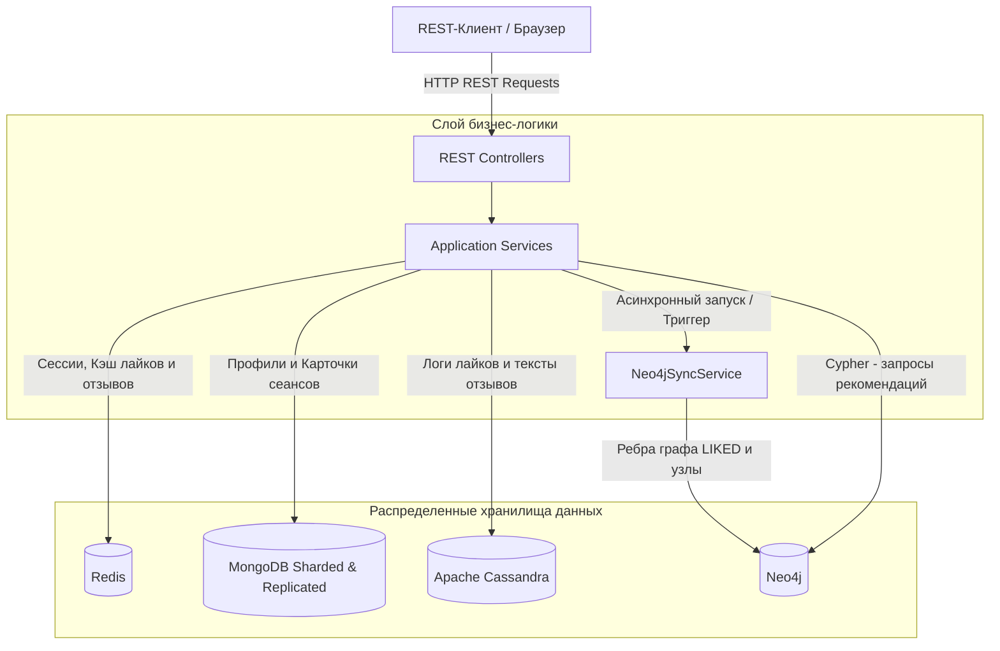
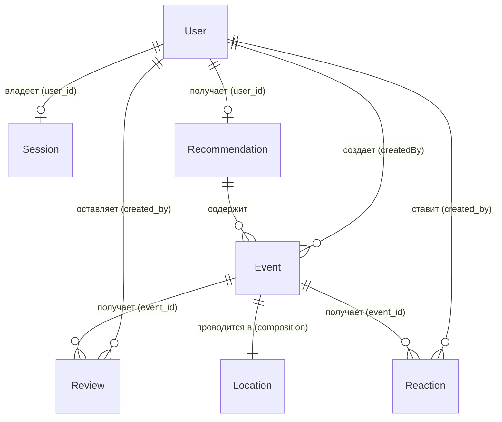

# EventHub - NoSQL Database Project

[](https://github.com/nikiforovaE/no-sql/actions/workflows/eventhub.yml)

1. **[Лабораторные работы](https://github.com/sitnikovik/ndbx/tree/main/docs/lab)** — технические задания
2. **[CONTRIBUTING.md](CONTRIBUTING.md)** — требования к структуре и разработке
3. **[Документация курса](https://github.com/sitnikovik/ndbx)** — методические материалы

## 🛠 Технологический стек

- **Язык программирования:** Java 21
- **Фреймворк:** Spring Boot 4.0.3
- **Система сборки:** Maven
- **Базы данных:**
    - Redis 7: Ключ-значение база данных для управления сессиями и кэширования реакций/сводной статистики отзывов.
    - MongoDB 8.0: Документо-ориентированная база данных (кластер с шардированием коллекции events и репликацией
      профилей users).
    - Apache Cassandra: Распределенная колоночная СУБД для надежного хранения больших объемов лайков и текстовых
      отзывов.
    - Neo4j 5: Графовая СУБД для построения рекомендательных графовых связей (User-[:LIKED]->Event) и поиска
      пересечений.
- **Ключевые библиотеки и их назначение**
    - Spring Data (Redis, MongoDB, Cassandra, Neo4j): Упрощенный доступ к базам данных.
    - Spring Boot Starter Web: Построение REST API на базе Spring MVC.
    - Spring Security Crypto: Надежное хэширование и сверка паролей пользователей по алгоритму BCrypt.
    - Springdoc OpenAPI WebMVC UI (Swagger UI): Автоматическая генерация интерактивной спецификации API и визуальный
      веб-интерфейс для отправки запросов.
    - Jakarta Validation: Проверка корректности входных данных (DTO) на уровне контроллеров.
    - Lombok: Автогенерация геттеров, сеттеров, конструкторов и паттерна Builder.
    - Commons Codec: Утилиты для работы с хэшированием.

- **Инструментарий:** Docker, Docker Compose, Swagger (OpenAPI)
- **Оркестрация:** Docker & Docker Compose

---

## 🏗 Архитектура проекта

### 1. Структура пакетов (высокоуровневая)

Приложение организовано по классической многослойной структуре:

* `config/` — конфигурация подключения к базам данных (Redis, MongoDB, Cassandra, Neo4j).
* `controller/` — REST-контроллеры для обработки входящих запросов (веб-уровень).
* `dto/` — классы-обертки для объектов запросов и ответов (Request/Response).
* `model/` — доменные сущности для MongoDB (`User` и `Event`).
* `repository/` — интерфейсы Spring Data для работы с MongoDB.
* `service/` — бизнес-логика (аутентификация, кэширование, расчет рекомендаций и синхронизация графа).
* `util/` — утилиты для сборки кук и генерации токенов сессий.

---

### 2. Схема взаимодействия компонентов



### Физическое распределение данных по СУБД:

#### 1. Управление сессиями (Redis)

* **Тип данных:** Hash. Ключ: `sid:{session_id}`.
* **Состав:** `created_at`, `updated_at`, `user_id`.
* **Жизненный цикл:** TTL (время жизни) обновляется при `POST`-запросах.

#### 2. Хранение сущностей (MongoDB)

* **Коллекция `users`:** Профили пользователей. Настроена репликация (1 Primary, 2 Secondary) и уникальный индекс по
  `username`.
* **Коллекция `events`:** Карточки мероприятий. Настроено шардирование по хэш-ключу `created_by` (ID создателя) для
  масштабирования записи.

#### 3. Реакции (Apache Cassandra & Redis)

* **Cassandra:** Таблица `event_reactions` (лайки/дизлайки). PRIMARY KEY (`event_id`, `created_by`).
* **Redis:** Кэширование счетчиков лайков/дизлайков по MD5-хэшу названия мероприятия (`event:{hash}:reactions`).
* **Связь:** Агрегация лайков идет по названию мероприятия (сквозная статистика для разных сеансов).

#### 4. Отзывы (Apache Cassandra & Redis)

* **Cassandra:** Таблица `event_reviews` (комментарий до 300 символов, оценка 1-5). PRIMARY KEY (`event_id`,
  `created_by`).
* **Redis:** Кэширование среднего рейтинга и общего количества отзывов (`event:{hash}:reviews`).
* **Особенность:** Реализован принцип "один пользователь — один отзыв на мероприятие".

#### 5. Рекомендации (Neo4j & Redis)

* **Neo4j:** Графовая модель со связью `(u:User)-[:LIKED]->(e:Event)` на основе лайков для подбора рекомендаций по
  интересам.
* **Redis:** Кэширование готового списка рекомендаций для пользователя (`user:{user_id}:recomms`) по принципу
  Cache-Aside.

***

### 3. Основные сущности



#### Краткое описание сущностей:

* **User (Пользователь):** Авторизованный организатор или гость с хэшированным паролем в MongoDB.
* **Event (Мероприятие):** Карточка события с описанием, категорией и ценой, хранящаяся в MongoDB.
* **Location (Локация):** Место проведения (город и адрес). Хранится только внутри карточки события (композиция).
* **Reaction (Реакция):** Социальный отклик (лайк/дизлайк). Логи хранятся в Cassandra, счетчики кэшируются в Redis, а
  лайки зеркалируются в граф Neo4j.
* **Review (Отзыв):** Оценка (1–5) и текст комментария до 300 символов. Пишется в Cassandra, статистика кэшируется в
  Redis.
* **Session (Сессия):** Сессионный контекст в Redis (изначально анонимный, после логина связывается с `User.id`).
* **Recommendation (Рекомендация):** Персональный список событий для пользователя, рассчитанный в Neo4j и закэшированный
  в Redis.

---

## 🎯 Функциональные требования / Use Cases

Система реализует бизнес-сценарии для двух типов пользователей:

### 1. Сценарии для неавторизованных пользователей (Гостей)

* **Инициализация сессии:** При первом обращении к любому эндпоинту гость автоматически получает анонимную сессию в виде
  куки `X-Session-Id`.
* **Просмотр и поиск событий:** Гость может искать мероприятия с использованием гибких фильтров (по категории, городу
  проведения, диапазону цен, датам начала и организатору).
* **Просмотр отзывов:** Гость может просматривать отзывы к любому мероприятию, а также видеть усредненный рейтинг
  события.
* **Регистрация и Вход:** Гость может зарегистрировать новый аккаунт или войти в систему. При авторизации его текущая
  анонимная сессия в Redis связывается с его `user_id` из MongoDB.

### 2. Сценарии для авторизованных пользователей

* **Создание мероприятий:** Пользователь может опубликовать новое событие, указав название, адрес, описание и даты
  проведения.
  При создании событие автоматически индексируется в графе Neo4j.
* **Редактирование мероприятий (Организатор):**
  Автор мероприятия может частично обновлять его данные (`category`, `price`, `city`).
* **Управление реакциями (Лайки/Дизлайки):** Пользователь может поставить лайк или дизлайк.
* **Оценка и отзывы:** Пользователь может оставить один текстовый отзыв (до 300 символов) с оценкой от 1 до 5 на
  мероприятие. Свой отзыв можно редактировать через `PATCH`. Средний рейтинг автоматически пересчитывается и обновляется
  в Redis.
* **Персональные рекомендации:** Пользователь может запросить индивидуальную подборку мероприятий, которая
  рассчитывается в Neo4j на основе похожих лайков других пользователей.

***

## 📋 API Эндпоинты

Вся интерактивная документация API генерируется автоматически на основе OpenAPI-спецификации.

* **[Локальный Swagger UI](http://localhost:8080/swagger-ui/index.html):** доступен после запуска приложения
* **[Файл спецификации](api/swagger-api-docs.json):** актуальный JSON-файл спецификации со всеми эндпоинтами

### Основные эндпоинты:

- **Сессии и Аутентификация:**
    - `GET /health` — проверка статуса и обновление TTL сессии.
    - `POST /session` — создание/продление анонимной сессии.
    - `POST /auth/login` / `POST /auth/logout` — управление входом.
    - `POST /users` — регистрация нового пользователя.

- **События (MongoDB):**
    - `POST /events` — создание мероприятия (только для организаторов).
    - `GET /events` — поиск с фильтрами по цене, дате, городу и категории. Поддерживает `include=reactions,reviews`.
    - `GET /events/{id}` — детальная карточка конкретного сеанса мероприятия по ID.
    - `PATCH /events/{id}` — редактирование данных события (доступно только его автору).

- **Организаторы:**
    - `GET /users` — поиск по именам и ID.
    - `GET /users/{id}` — просмотр публичной карточки организатора по ID.
    - `GET /users/{id}/events` — просмотр всех мероприятий, созданных конкретным организатором (поддерживает параметр
      `include`).

- **Реакции и Отзывы (Cassandra/Redis):**
    - `POST /events/{id}/like` — поставить лайк (обновляет дизлайк).
    - `POST /events/{id}/dislike` — поставить дизлайк.
    - `POST /events/{id}/reviews` — оставить отзыв с рейтингом 1-5.
    - `GET /events/{id}/reviews` — список отзывов к мероприятию с пагинацией.
    - `PATCH /events/{id}/reviews/{review_id}` — редактирование своего отзыва.

- **Рекомендации (Neo4j/Redis):**
    - `GET /recommendations` — получение персональной ленты рекомендованных мероприятий на основе графа лайков похожих
      пользователей.

---

## 🚀 Как запустить проект

### Предварительные требования

Для локального запуска вам потребуются установленные:

- [Docker](https://docs.docker.com/get-docker/) и Docker Compose
- Утилита `make`

### 1. Настройка окружения

Создайте `.env.local` в корне проекта (см. пример в секции конфигурации).

### 2. Запуск и остановка

```bash
make run   # Запуск всех сервисов (Redis, Mongo, Cassandra, App)
make stop  # Остановка и удаление контейнеров
```

*После запуска сервис доступен по адресу: `http://localhost:8080`*

---
---

## ⚙️ Конфигурация (.env.local)

В корне проекта должен находиться конфигурационный файл `.env.local`.

```env
# Хост, по которому доступно ваше приложение
APP_HOST=0.0.0.0
# Порт, на котором оно слушает запросы
APP_PORT=8080
# Время жизни сессии в секундах
APP_USER_SESSION_TTL=60 # 1 минута (ДЛЯ ТЕСТОВ)
# Время жизни лайков в кэше в секундах.
APP_LIKE_TTL=60

# Redis connection
# Хост Redis сервера
REDIS_HOST=redis
# Порт Redis сервера
REDIS_PORT=6379
# Пароль для Redis (оставьте пустым, если пароль не используется)
REDIS_PASSWORD=
# Номер базы данных Redis (по умолчанию - 0)
REDIS_DB=0

# MongoDB connection
MONGODB_DATABASE=eventhub
# Имя пользователя для аутентификации в MongoDB
MONGODB_USER=eventhub
# Пароль для аутентификации в MongoDB
MONGODB_PASSWORD=eventhub
# Хост MongoDB сервера
MONGODB_HOST=mongos
# Порт MongoDB сервера
MONGODB_PORT=27017
MONGO_SHARD_PORT=27018

# Список хостов Cassandra в виде строки, разделенной запятыми (пока что один хост).
CASSANDRA_HOSTS=cassandra-test
# Порт Cassandra
CASSANDRA_PORT=9042
# Имя пользователя для подключения к Cassandra
CASSANDRA_USERNAME=
# Пароль для подключения к Cassandra
CASSANDRA_PASSWORD=
# Имя ключевого пространства Cassandra
CASSANDRA_KEYSPACE=testkeyspace
# Уровень согласованности Cassandra
CASSANDRA_CONSISTENCY=ONE
```

### 2. Запуск приложения

В корне проекта выполнить команду:

```
make run
```

*После запуска сервис будет доступен по адресу: `http://localhost:8080`*

### 3. Остановка приложения

Для остановки всех контейнеров выполнить команду:

```bash
make stop
```

---
Вот обновленный раздел **API Эндпоинты**, включающий все изменения из лабораторных работ №3–6 (включая отзывы,
расширенные фильтры и пагинацию):

---

## 📋 API Эндпоинты

> 💡 Коллекция запросов находится [здесь](api/swagger-api-docs.json)

### Сессии и состояние

- `GET /health` — проверка работоспособности системы. Возвращает статус "ok" и обновляет TTL куки `X-Session-Id`, если
  она валидна.
- `POST /session` — управление анонимной сессией. Создает новую сессию (201) или продлевает существующую (200).

### Аутентификация и пользователи

- `POST /users` — регистрация нового пользователя. Создает профиль и автоматически открывает авторизованную сессию.
- `POST /auth/login` — вход в систему. Проверяет credentials и привязывает ID пользователя к текущей сессии в Redis.
- `POST /auth/logout` — выход. Удаляет данные сессии из Redis и принудительно очищает куку (`Max-Age=0`).

### Организаторы

- `GET /users` — поиск организаторов. Поддерживает фильтрацию по `name` (частичное совпадение) и `id`, а также
  пагинацию (`limit`, `offset`).
- `GET /users/{id}` — получение публичного профиля организатора (имя, логин) по его идентификатору.
- `GET /users/{id}/events` — список мероприятий, созданных конкретным организатором. Поддерживает параметр `include`.

### Мероприятия

- `POST /events` — создание нового мероприятия. Доступно только авторизованным пользователям.
- `GET /events` — поиск мероприятий с мощной фильтрацией:
    - По подстроке в названии (`title`), категории (`category`), городу (`city`).
    - По диапазону цен (`price_from`, `price_to`) и дат (`date_from`, `date_to`).
    - По точному совпадению `id` или никнейму создателя (`user`).
    - **Опциональные данные**: включение счетчиков реакций и рейтингов через `include=reactions,reviews` (можно
      передавать через запятую).
- `GET /events/{id}` — детальная информация о конкретном сеансе мероприятия.
- `PATCH /events/{id}` — редактирование мероприятия. Доступно только его организатору. Позволяет менять категорию, цену
  и город (пустая строка в `city` удаляет поле).

### Реакции и Отзывы

- `POST /events/{id}/like` — поставить лайк. Данные сохраняются в Cassandra. Если был дизлайк — он перезаписывается.
- `POST /events/{id}/dislike` — поставить дизлайк. Работает аналогично лайку, обновляя статус реакции пользователя.
- `POST /events/{id}/reviews` — оставить отзыв на мероприятие (оценка 1-5 и комментарий). Доступно только авторизованным
  пользователям (один отзыв на человека).
- `GET /events/{id}/reviews` — получение списка отзывов для конкретного мероприятия с поддержкой пагинации (`limit`,
  `offset`).
- `PATCH /events/{id}/reviews/{review_id}` — редактирование своего отзыва. Позволяет изменить текст комментария или
  оценку.

---
